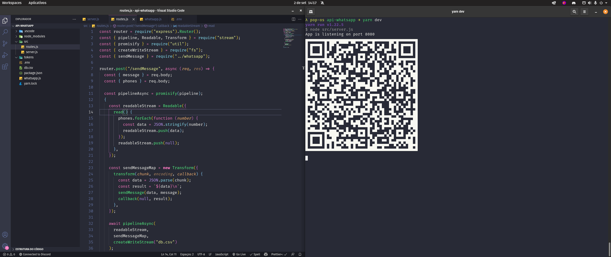
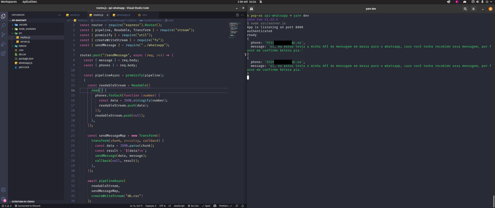

<h1 align="center">
API Whatsapp - para envio de mensagens
</h1>

<p align="center">
  <a href="https://github.com/aleksanderpalamar/Dev-search/graphs/contributors">
    
  </a>
  <a href="https://opensource.org/licenses/MIT">
    
  </a>
</p>
<p align="center">
  
  
</p>

<hr>

## Teconologias utilizadas

- [Express](https://expressjs.com/pt-br/)
- [NodeJS](https://nodejs.org/en/)
- [whatsapp-web.js](https://guide.wwebjs.dev/)
- [qrcode-terminal](https://www.npmjs.com/package/qrcode-terminal)

## Local development

1. Criar o arquivo `.env` com as variáveis de desenvolvimento:

```
SESSION_FILE_PATH=./tokens/session.json
```

2. Run the development server:

```bash
npm run dev
# or
yarn dev
```
